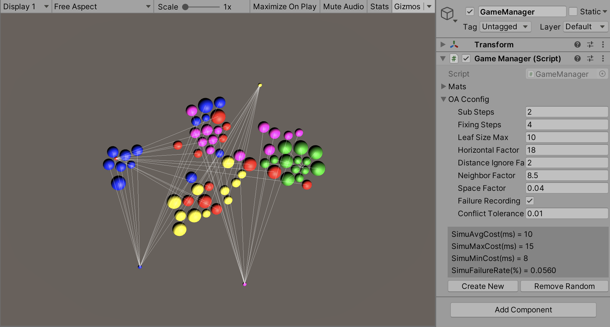
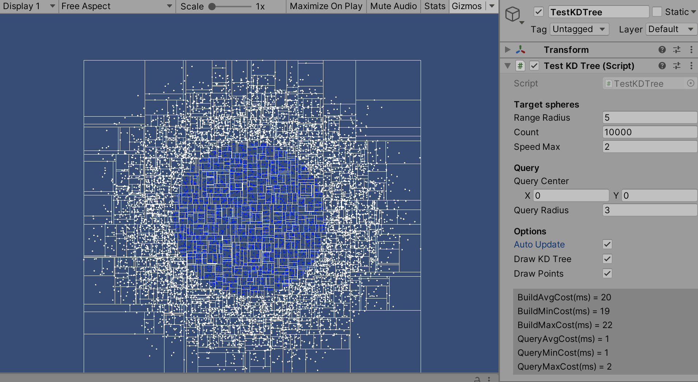

## Easy Obstacle Avoidance

A very simple obstacle avoidance implementation including basic 2d obstacle avoidance functions in C# but independent of any Unity Engine codes. A kd-tree implementation is embedded for neighbor-querying, while it can also be used standalone.

The following images are showing the sample cases in this project:

obstacle avoidance:

kd-tree:

